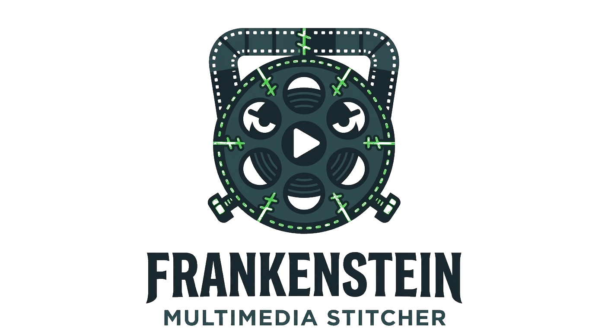

<p align="center">
  
</p>


<p align="center">
  <em>Frankenstein - Stitch the best video and audio from different MKV files into one perfectly synced copy.</em>
</p>

<p align="center">
  <a href="LICENSE"></a>
  
  
</p>

---

## The problem

You have two versions of the same film:

- **`movie_hq.mkv`** — **high-quality video** (H.265 1080p) but only the original language audio
- **`movie_lang.mkv`** — **your preferred language dub**, but low-quality video

Naively muxing them together leaves the audio out of sync: the two versions may differ due to **gradual drift** (e.g. 29.97 vs 30 fps sources) or **discrete cuts** (censored/missing scenes in one version).

`frankensync` detects and corrects both automatically, then produces a new MKV with the tracks you chose.

## Installation

### Prerequisites

Install [ffmpeg](https://ffmpeg.org/) and [mkvtoolnix](https://mkvtoolnix.download/):

```bash
# Debian / Ubuntu
sudo apt install ffmpeg mkvtoolnix

# macOS
brew install ffmpeg mkvtoolnix
```

### Install frankensync

Requires Python >= 3.11 and [uv](https://github.com/astral-sh/uv):

```bash
uv tool install git+https://github.com/n-elia/frankenstein
```

## Quick start

1. Copy both MKV files into the same folder
2. Open a terminal in that folder and run:

```bash
frankensync
```

3. Pick the video, audio, and subtitle tracks in the interactive TUI
4. Done -- the merged file is written as `<name>_merged.mkv` in the same folder

## Advanced usage

```bash
frankensync <file1.mkv> <file2.mkv> [--output PATH]
```

| Argument | Description |
|---|---|
| `file1`, `file2` | MKV files to merge (optional in directory mode) |
| `--output`, `-o` | Output path. Defaults to `<stem>_merged.mkv`. |

From a local checkout, prefix with `uv run`:

```bash
uv run frankensync movie_hq.mkv movie_lang.mkv -o movie_final.mkv
```

## Features

- **Interactive TUI** ([Textual](https://textual.textualize.io/)) to pick video, audio, and subtitle tracks across both source files
- **Chroma cross-correlation** ([librosa](https://librosa.org/) + [scipy](https://scipy.org/)) to compute the exact time mapping between the two audio versions
- **No video re-encoding** -- the video track is always stream-copied
- **Lossless audio correction** for pure drift (`mkvmerge --sync` adjusts PTS timestamps only)
- **Re-encoding only when cuts require it** -- uses the source codec where possible, falls back to AAC, and fills censored gaps with the reference audio
- **Subtitle realignment** -- SRT and ASS/SSA timestamps are remapped using the same warp map; bitmap formats (PGS/VOBSUB) get a constant offset

### Supported formats

| Category | Supported formats | Notes |
|---|---|---|
| Container | MKV | Via [mkvtoolnix](https://mkvtoolnix.download/) for muxing/extraction and [ffprobe](https://ffmpeg.org/) for inspection |
| Video | All codecs supported by [ffmpeg](https://ffmpeg.org/) | Always stream-copied, never re-encoded |
| Audio | All codecs supported by [ffmpeg](https://ffmpeg.org/) | Lossless PTS correction via `mkvmerge --sync`; re-encoding only when cuts require it |
| Subtitles | SRT, ASS/SSA | Full warp-map remap via [scipy](https://scipy.org/) interpolation |
| Subtitles (bitmap) | PGS, VOBSUB | Constant offset only |

## Documentation

- [Architecture & design](docs/architecture.md)
- [Development & project structure](docs/development.md)
- [Test strategy](docs/test-strategy.md)
