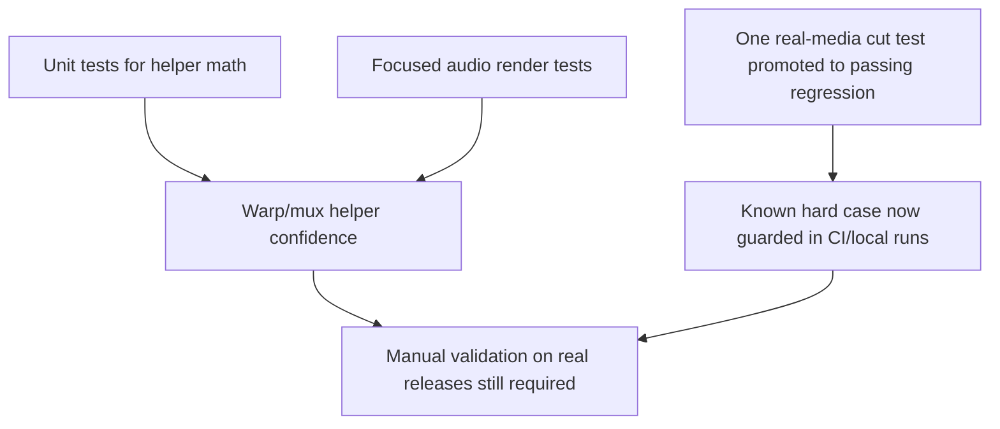
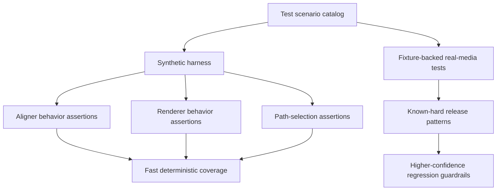
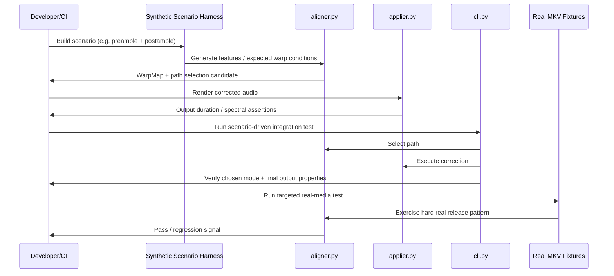

# Technical Proposal: Strengthen Scenario-Driven Test Coverage

**Date:** 2026-04-14
**Issue:** N/A
**Status:** Implemented

---

## 1. Problem Statement

`Frankenstein` has accumulated a useful set of unit and focused integration tests, but recent regressions showed that the suite still leaves important behavioral gaps untested. In particular, two bugs reached manual validation despite multiple recent test additions:

1. a **global cross-correlation sign mismatch** caused selected-audio preambles to be padded instead of trimmed;
2. a **linear-path routing bug** sent unmatched-edge cases through lossless mux sync when they actually required rendered trimming.

The project does not primarily suffer from a low number of tests. It suffers from **coverage concentrated in local helpers** while the real failures occur at **module boundaries, fallback paths, and whole-pipeline behavior**.

The aim of this proposal is to define a test strategy that makes those failure modes much harder to reintroduce by building a scenario-driven coverage matrix around real synchronization behavior, not just helper correctness.

### Current State



### Issues Identified

1. **Helper-level correctness is better covered than pipeline-level correctness.**  
   The suite proves that several isolated functions behave correctly, but not always that the composed pipeline selects the correct path.

2. **Fallback behavior is under-specified in tests.**  
   Weak-match, no-anchor, and linear-fallback paths are exactly where sign and routing bugs hide.

3. **Output-shape assertions are still too sparse.**  
   The suite often verifies internal structures but not enough end-user-visible outcomes such as final rendered duration or trimming behavior.

4. **Real-media fixture coverage started from one previously failing cut case.**  
   That case is now promoted to a normal passing regression, but broader fixture variety is still needed for stronger confidence.

### Failure Scenarios

| Failure | Current state | Outcome |
| --- | --- | --- |
| Selected audio has leading preamble | Weak-match fallback uses wrong sign convention | Initial silence instead of trimmed intro |
| Selected audio has unmatched postamble | Linear case still routed through lossless sync | Extra audio continues past video end |
| Selected audio has missing middle scene | Helper tests pass, real detection still weak | Hole may not be detected in practice |
| Refactor changes path-selection logic | Unit tests still green | Wrong correction strategy chosen |

---

## 2. Design

### Core Idea

The proposal is to move from a mostly component-oriented test suite to a **scenario-driven test pyramid**. The new shape is:

1. keep the existing helper tests;
2. add a reusable **synthetic media scenario harness** for deterministic edge cases;
3. add a small but deliberate set of **fixture-backed end-to-end assertions** against real MKVs;
4. explicitly test **path selection**, not just path internals.

If the reader remembers one thing, it should be this: **every synchronization strategy used by the app must be covered by at least one “user-visible result” test**.

```text
Current:  helper math -> some render tests -> manual spot checks
Proposed: helper math -> scenario harness -> pipeline/path-selection tests -> real-media fixtures
```

### Design Principles

1. **Behavior over implementation detail.** A test should prefer asserting output duration, trimming, gap fill, or mux path selection over asserting a private intermediate unless the intermediate is itself the contract.
2. **Each correction mode needs a representative scenario.** No-op, offset, edge trim, hole fill, and cut-detection fallback must each have explicit coverage.
3. **Real media should confirm, not carry, the suite.** Synthetic tests should be deterministic and cheap; real fixtures should validate realism and catch integration drift.
4. **Known limitations must stay visible.** Real-media expected failures are acceptable only when they document a real unresolved weakness and are paired with a concrete improvement target.
5. **The suite must remain runnable in ordinary developer environments.** Heavy fixture tests should be gated and purposeful, not explode runtime.

### Proposed State Machine / Architecture



The key change is not a new production subsystem; it is a new **testing architecture**. Today, most tests are organized around files/functions. The proposed design reorganizes coverage around **sync scenarios**. This was chosen over simply adding more unit tests because the recent bugs were caused by interactions between already-tested pieces.

### Proposed Flow



### Stuck-Point Analysis

| Step | State after crash | Recoverable? |
| --- | --- | --- |
| Add synthetic harness only | Better deterministic coverage, no fixture expansion yet | Yes |
| Add path-selection assertions | Existing tests still work; more explicit failure modes | Yes |
| Add fixture-backed scenarios | Longer test surface, but isolated and skippable | Yes |
| Promote an expected failure to a normal test prematurely | CI turns red for known limitation | Yes, by reverting promotion or fixing detection |

---

## 3. Shared Layer / Core Changes

### 3.1. Introduce a scenario catalog

The suite should define an explicit set of named timing scenarios instead of informally growing tests file by file.

```python
# tests/scenarios.py
from dataclasses import dataclass


@dataclass(frozen=True)
class SyncScenario:
    name: str
    kind: str
    requires_real_media: bool = False
```

Implementation notes:

- This is primarily organizational, not clever.
- The value is in forcing the suite to answer: “which user-visible sync situations do we cover?”

### 3.2. Build a reusable synthetic audio harness

Current synthetic tests already build tones ad hoc in `tests/test_gap_fill.py`. That should be generalized into shared helpers.

```python
# tests/audio_harness.py
from pathlib import Path
import tempfile

import numpy as np
import soundfile as sf


def write_tone_sequence(path: Path, segments: list[tuple[float, float]], sample_rate: int = 16000) -> None:
    """Write a deterministic tone sequence for sync-path assertions."""
    parts: list[np.ndarray] = []
    for frequency, duration in segments:
        t = np.linspace(0.0, duration, int(sample_rate * duration), endpoint=False)
        parts.append(0.25 * np.sin(2 * np.pi * frequency * t))
    sf.write(path, np.concatenate(parts), sample_rate)
```

Implementation notes:

- This lets tests express scenarios such as preamble, postamble, and gap-fill in a compact, readable way.
- The existing gap-fill tests are already close to this pattern; this change formalizes it.

### 3.3. Add path-selection assertions in the CLI/orchestration layer

The suite should verify not only that renderers work, but that the application picks the right strategy.

```python
# tests/test_path_selection.py
import unittest
from unittest.mock import patch

from film_tracks_aligner.cli import _run_pipeline
from film_tracks_aligner.models import TrackSelection, WarpMap, WarpSegment


class PathSelectionTests(unittest.TestCase):
    def test_linear_full_overlap_uses_lossless_sync(self) -> None:
        selection = make_selection()
        warp_map = WarpMap(
            segments=[WarpSegment(0.0, 10.0, 0.0, 10.0)],
            ref_duration=10.0,
            sel_duration=10.0,
        )

        with patch("film_tracks_aligner.cli.compute_warp_map", return_value=(warp_map, 0.9)), \
             patch("film_tracks_aligner.cli.apply_warp", return_value=None) as apply_warp_mock:
            # invoke _run_pipeline() with mocked extractors
            ...

        apply_warp_mock.assert_called_once()
        # caller should observe the lossless path via None
```

Implementation notes:

- This directly targets the class of bug that caused unmatched-edge linear cases to take the wrong route.
- It is more stable than trying to infer path selection indirectly from one helper’s result.

### 3.4. Expand fixture-backed integration tests around real releases

The repository already has:

- local MKV fixtures under `tests/fixtures/movies/`
- one real-media cut-detection regression test (now passing)

That should grow into a small fixture suite covering:

- preamble-only
- postamble-only
- preamble + postamble
- known middle-hole censored case

```python
# tests/test_real_media_matrix.py
import unittest


class RealMediaMatrixTests(unittest.TestCase):
    @unittest.skipUnless(...)
    def test_fixture_with_preamble_trims_to_reference_duration(self) -> None:
        ...
```

Implementation notes:

- The suite should prefer **short extracted excerpts** from the fixtures to keep runtime bounded.
- We should keep using local ignored MKVs rather than committing massive media into the repository.

---

## 4. Implementation Variants

### 4.1. Fast deterministic variant

This variant uses only synthetic audio generated during test execution.

Use it for:

- sign convention
- trimming behavior
- hole fill
- duration matching
- basic path routing

Trade-off:

- very stable
- not enough to prove real release detection quality

### 4.2. Fixture-backed realism variant

This variant uses short excerpts cut from user-provided local MKV fixtures.

Use it for:

- confirming that real soundtrack structure behaves as expected
- validating that synthetic assumptions are not too optimistic
- documenting unresolved hard cases

Trade-off:

- more realistic
- slower and slightly more environment-sensitive

---

## 5. Constraints & Research Findings

| Finding | Implication |
| --- | --- |
| The current suite already proves helper correctness in several areas | We should extend the test shape, not replace everything |
| The previous `expectedFailure` cut fixture is now a normal passing regression | Keep this case mandatory while expanding fixture diversity |
| ffmpeg-based tests are already in use successfully | Adding more short rendered-audio assertions is practical |
| Large MKVs should not be committed | Fixture strategy must assume locally-provided ignored assets |

---

## 6. Deployment Strategy Matrix

### Deployment Strategies

| ID | Topology | Key components | Description | Scaling |
| --- | --- | --- | --- | --- |
| D1 | Local developer machine | `uv`, `ffmpeg`, local fixtures | Full suite including fixture-backed tests | Manual / local |
| D2 | CI default | Python + fast tools only | Synthetic and unit/integration tests, fixture tests skipped or reduced | Per push/PR |
| D3 | Nightly / richer validation | CI with fixture access | Extended real-media matrix | Scheduled |

### Mechanism Coverage

| Mechanism | D1 | D2 | D3 |
| --- | --- | --- | --- |
| Helper math tests | Essential | Essential | Essential |
| Synthetic render/path tests | Essential | Essential | Essential |
| Real-media preamble/postamble tests | Yes | Optional/Skipped | Essential |
| Real-media hard cut-detection regression | Yes | Optional/Skipped | Essential |

### Failure Recovery

| Failure scenario | D1 | D2 | D3 |
| --- | --- | --- | --- |
| Synthetic scenario regression | Immediate local failure | Immediate CI failure | Immediate failure |
| Fixture test fails due to environment | Developer inspects local fixture/tool setup | Skip by design | Retry or inspect runner image |
| Former hard-case regression fails again | Developer inspects aligner fallback/cut recovery | Caught by default suite | Nightly confirms robustness |

### Recommendations

- **D1:** primary development workflow; use when changing alignment or rendering behavior.
- **D2:** keep fast and deterministic; protect mainline against obvious regressions.
- **D3:** use to measure progress on real-media reliability, especially cut detection.

---

## 7. Implementation Priority

1. **Shared synthetic harness** — extract reusable helpers from current ad hoc tone-based tests.
2. **Scenario matrix inventory** — define the canonical list of behaviors the app must cover.
3. **Path-selection integration tests** — lock down routing between lossless sync and rendered correction.
4. **Output-shape assertions** — add duration/start/end/gap-fill checks for each canonical scenario.
5. **Real-media fixture matrix** — expand from one hard cut regression to a broader release-pattern set.
6. **Regression hardening policy** — keep hard real-media cases as normal tests and add new ones incrementally.

---

## 8. Key Files Affected

| File | Changes |
| --- | --- |
| `tests/test_gap_fill.py` | Likely refactor into shared harness + scenario-specific tests |
| `tests/test_linear_alignment.py` | Keep low-level sign/math assertions |
| `tests/test_cut_detection.py` | Expand real-media and cut-behavior assertions |
| `tests/test_directory_mode.py` | Unchanged in purpose; useful example of CLI-behavior testing |
| `tests/audio_harness.py` | New shared synthetic audio utilities |
| `tests/test_path_selection.py` | New orchestration/path-choice tests |
| `tests/test_real_media_matrix.py` | New fixture-backed scenario matrix |
| `docs/test-coverage-proposal.md` | This proposal |

---

## 9. Decisions Log

| Decision | Rationale |
| --- | --- |
| Organize new coverage around **scenarios** rather than modules | The recent regressions were not caused by a single helper being obviously wrong; they were caused by interactions between stages. Scenario-driven coverage matches how users experience failure. |
| Keep both synthetic and fixture-backed layers | Synthetic tests are deterministic and cheap; real fixtures catch realism gaps. Using only one of these would either make the suite too brittle or too idealized. |
| Add explicit **path-selection** tests | The trailing-audio bug was a routing problem, not a rendering primitive problem. Testing route choice directly closes that class of gap. |
| Promote hard real-media cases to normal regressions once fixed | Once recovery logic exists (for example sparse-anchor edge-offset cut rescue), keeping the case as expected failure weakens CI signal. |
| Avoid committing large MKV fixtures | The current repository and workflow already assume local ignored fixtures. That is the pragmatic balance between realism and repository hygiene. |
| Prioritize output-duration and boundary assertions | Start/end trimming and total duration are the most user-visible contracts. They are stronger regression guards than many internal-only assertions. |
